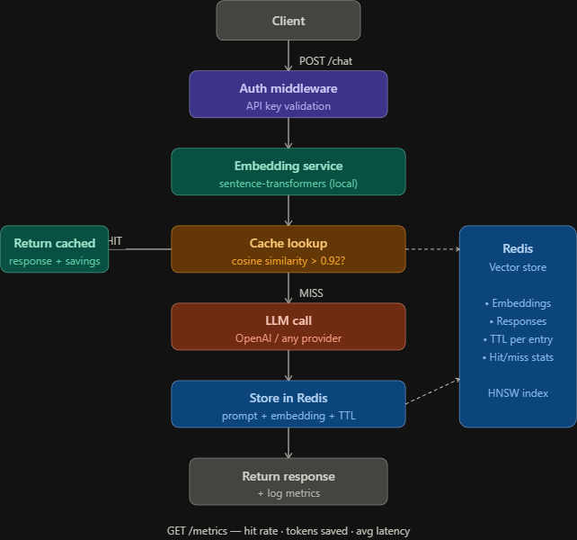

# Semantic Cache Proxy

A FastAPI middleware that intercepts LLM API calls and serves cached responses for semantically similar queries — without ever hitting the upstream provider.

Traditional caching fails for conversational AI because users phrase the same question differently every time. This proxy solves that by comparing vector embeddings instead of strings. _"What is gradient descent?"_ and _"Can you explain gradient descent to me?"_ are the same question — and they'll both hit the cache.

---

## How it works



Every cache miss stores the prompt, its embedding, and the LLM response in Redis with a TTL. Future semantically similar queries skip the LLM entirely.

---

## Features

- **Semantic matching** — cosine similarity over vector embeddings, not exact string comparison
- **Local embeddings** — `sentence-transformers` runs entirely on your machine, no external embedding API needed
- **Redis vector store** — fast nearest-neighbour lookup with HNSW index
- **Metrics endpoint** — real-time hit rate, latency saved, and estimated token cost savings
- **Auth middleware** — API key validation on every request
- **TTL-based expiry** — configurable cache lifetime per entry
- **Docker Compose** — Redis + app wired up and ready to run

---

## Project structure

```
semantic-cache-proxy/
├── app/
│   ├── main.py                 # FastAPI app, route registration
│   ├── routes/
│   │   └── chat.py             # POST /chat endpoint
│   ├── services/
│   │   ├── cache.py            # Redis lookup + cosine similarity logic
│   │   ├── embeddings.py       # sentence-transformers wrapper
│   │   ├── llm.py              # OpenAI call + response handling
│   │   └── metrics.py          # Hit rate, latency, token savings tracking
│   ├── models/
│   │   └── schemas.py          # Pydantic request/response models
│   └── config.py               # Environment config via pydantic-settings
├── tests/
│   └── test_cache.py
├── docker-compose.yml
├── Dockerfile
├── requirements.txt
├── .env.example
└── README.md
```

---

## Getting started

### Prerequisites

- Docker and Docker Compose
- Python 3.9+
- An OpenAI API key (or any supported LLM provider)

### 1. Clone and configure

```bash
git clone https://github.com/your-username/semantic-cache-proxy.git
cd semantic-cache-proxy
cp .env.example .env
```

Edit `.env` with your keys:

```env
OPENAI_API_KEY=sk-...
REDIS_URL=redis://localhost:6379
SIMILARITY_THRESHOLD=0.92
CACHE_TTL_SECONDS=604800   # 7 days
API_KEY=your-proxy-api-key
```

### 2. Start Redis

```bash
docker compose up -d redis
```

### 3. Install dependencies

```bash
python -m venv venv
source venv/bin/activate      # Windows: venv\Scripts\activate
pip install -r requirements.txt
```

### 4. Run the proxy

```bash
uvicorn app.main:app --reload
```

The proxy is now running at `http://localhost:8000`.

---

## API reference

### `POST /chat`

Send a prompt through the proxy.

**Request**

```json
{
  "prompt": "What is gradient descent?"
}
```

**Response — cache hit**

```json
{
  "status": "cache_hit",
  "latency_ms": 620,
  "data": {
    "stored_prompt": "What is gradient descent?",
    "stored_response": "Gradient descent is an optimization algorithm...",
    "similarity": 1.0,
    "tokens_used": 48,
    "hit_count": 2
  }
}
```

**Response — cache miss**

```json
{
  "status": "cache_miss",
  "latency_ms": 620,
  "data": {
    "prompt": "What is gradient descent?",
    "response": "Gradient descent is an optimization algorithm..."
  },
  "tokens_used": 48
}
```

### `GET /metrics`

Returns cumulative stats since the proxy started.

```json
{
  "total_requests": 2,
  "cache_hits": 1,
  "tokens_saved": 48
}
```

---

## Redis schema

Each cached entry is stored as a Redis Hash:

```
cache:{uuid}
  ├── prompt        "What is gradient descent?"
  ├── embedding     <binary float32 array, 384 dims>
  ├── response      "Gradient descent is..."
  ├── tokens        142
  └── hit_count     3

cache:index              ← set of cached responses for indexing and semantic similarity search

metrics:total_requests   ← INCR counter
metrics:cache_hits       ← INCR counter
metrics:tokens_saved     ← INCRBYFLOAT counter
```

---

## Configuration reference

| Variable               | Default                  | Description                                       |
| ---------------------- | ------------------------ | ------------------------------------------------- |
| `SIMILARITY_THRESHOLD` | `0.92`                   | Minimum cosine similarity to count as a cache hit |
| `CACHE_TTL_SECONDS`    | `604800`                 | How long entries live (7 days)                    |
| `EMBEDDING_MODEL`      | `all-MiniLM-L6-v2`       | sentence-transformers model                       |
| `REDIS_URL`            | `redis://localhost:6379` | Redis connection string                           |
| `OPENAI_API_KEY`       | —                        | Your LLM provider key                             |
| `API_KEY`              | —                        | Key required on all proxy requests                |

---

## Why this matters

|                     | Without cache  | With cache (70% hit rate) |
| ------------------- | -------------- | ------------------------- |
| 1000 requests       | 1000 LLM calls | ~300 LLM calls            |
| Avg latency         | ~850ms         | ~260ms average            |
| Monthly cost (est.) | $10.00         | ~$3.00                    |

Actual savings depend on your traffic patterns and similarity threshold. Apps with repetitive query patterns (support bots, educational tools, internal RAG systems) see the highest hit rates.

---

## Roadmap

- [ ] HNSW vector index via RedisSearch for sub-millisecond lookup at scale
- [ ] Dynamic similarity threshold based on query complexity
- [ ] Multi-provider support (Anthropic, Gemini, local Ollama)
- [ ] Cache warming — pre-populate from a known FAQ dataset
- [ ] Prometheus metrics export

---

## Tech stack

- **FastAPI** — async REST API
- **sentence-transformers** (`all-MiniLM-L6-v2`) — local embedding generation
- **Redis** — vector store and metrics
- **OpenAI SDK** — LLM fallback
- **Docker Compose** — local orchestration
- **pydantic-settings** — typed environment config
